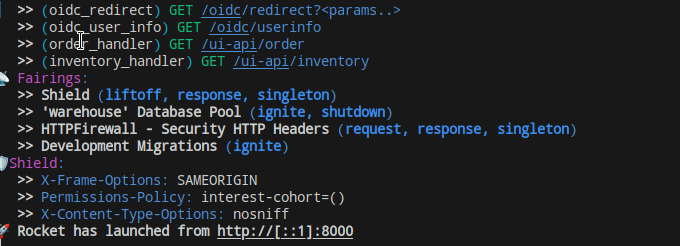
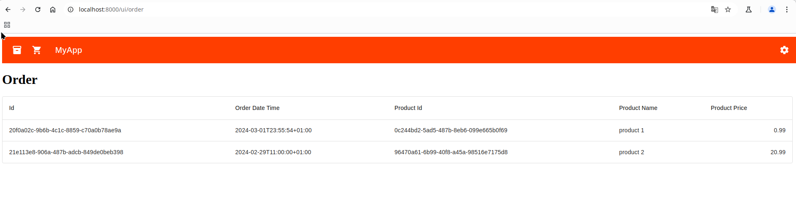

# Introduction - Build

## Prerequisites
You need to have Rust (at least 1.85.0) with support of the [2024 edition](https://doc.rust-lang.org/edition-guide/rust-2024/index.html).

Furthermore, you need to install [cargo-make](https://github.com/sagiegurari/cargo-make) as it is a bit more advanced build tool:
```
cargo install cargo-make
```

Additionally, you need to fulfill the [needs of the frontend](../../frontend/docs/BUILD.md).

# Run application for development

***Note: You need to configure an IDP to run the application. You can see how to use a free IDP Codeberg.org [here](./EXAMPLE-CODEBERG-OIDC.md)***

You can run the application for development as follows by entering the folder "backend" and running:
```
cargo make run
```

This builds the backend and the frontend (see [](../../frontend/README.md)).

.


You can open the application under http://localhost:8000

After login with your OIDC IdP you should see the application.

.

# Database
If you want to add additional test data to the database you can do so as follows:

Delete db/sqlite/warehouse.sqlite

Add your data to [../db/sqlx/migrations/20250127201400_init-dev-data.sql](../db/sqlx/migrations/20250127201400_init-dev-data.sql). 

Run the application as usual.

Note: If you do not want the application to populate test data then do not provide ../db/sqlx/migrations/20250127201400_init-dev-data.sql as part of the packaging.

All other scripts in  ../db/sqlx/migrations/* are needed to create/update the database structures in the target database. They allow smooth migrations and SQLx ensures that they are applied in the same order in all environments and it automatically detects which one have not been applied yes.

# Packaging
The application needs the following artifacts to run:
* ./db/sqlx/migrations/* - to create/update schemas in the database
* ./static/* - contains the frontend
* copy rust-rocket-backend from ./target/release


You can generate a [software bill of material](https://en.wikipedia.org/wiki/Software_supply_chain) (SBOM) using the command 
```
cargo make sbom
```

This will create a file rust-rocket-backend.cdx.xml containing the SBOM information.

See also the [Rocket deployment guide](https://rocket.rs/guide/deploying/).

# Building the application

You can build the application using 
```
cargo make build-all
```

This builds a release of the application backend and frontend. See previous section on what artifacts you need to run it.


# Automated Code Formatting

Having consistend formatting of code is crucial for its understanding by different developers. We employ here a tool that does this automatically for us.

During build the build script checks if the code is formatted according to standards defined by [rustfmt](https://github.com/rust-lang/rustfmt).

You can automatically fix the formatting of all of the code using
```
cargo make format
```

Afterwards your source code is formatted everywhere the same increasing its readability.

# Run tests
Tests are run during a build, but can be also triggered as follows:
```
cargo make test
```


# Update Dependencies
It is very important to keep your dependencies up-to-date to make your project secure and maintainable.

You can check if there is an update to your dependencies by running [cargo update](https://doc.rust-lang.org/cargo/commands/cargo-update.html).


Note: If your dependency has reached end-of-life (EOL), ie it is not maintained anymore, then this will command will NOT inform you. You need then check regularly if you dependencies have reached end-of-life (e.g. on their web sites) and find alternatives yourself.

You can partially find end-of-life dates on the crowd-sourced website https://endoflife.date

